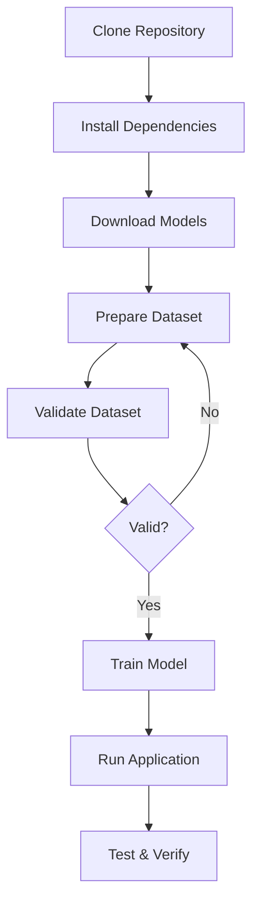

# Quick Start Guide

Hướng dẫn nhanh để bắt đầu với Face Access Control System.

## 🚀 5 Bước Nhanh

### 1️⃣ Cài Đặt Dependencies

```bash
pip install -r requirements.txt
```

### 2️⃣ Download Models

```bash
python download_models.py
```

Hoặc download thủ công theo [MODELS_DOWNLOAD.md](MODELS_DOWNLOAD.md)

### 3️⃣ Chuẩn Bị Dataset

**Option A: Capture từ webcam**

```bash
python capture_dataset.py
```

**Option B: Copy ảnh thủ công**

```
dataset/
├── User1/
│   └── (10-20 ảnh)
└── User2/
    └── (10-20 ảnh)
```

Xem chi tiết: [DATASET_GUIDE.md](DATASET_GUIDE.md)

### 4️⃣ Training

**LBPH (Nhanh)**:

```bash
python train_lbph.py
```

**FaceNet (Chính xác)**:

```bash
python train_facenet.py
```

### 5️⃣ Chạy Ứng Dụng

```bash
python main.py
```

---

## 📋 Checklist Đầy Đủ

### Trước Khi Bắt Đầu

- [ ] Python 3.8+ đã cài đặt
- [ ] Webcam hoạt động
- [ ] Git clone repository

### Setup

- [ ] Cài dependencies: `pip install -r requirements.txt`
- [ ] Download Haar Cascade model
- [ ] (Optional) Download DNN models
- [ ] (Cho FaceNet) Download FaceNet model

### Dataset

- [ ] Tạo thư mục cho mỗi user trong `dataset/`
- [ ] Mỗi user có 10-20 ảnh
- [ ] Chạy `python check_dataset.py` để validate

### Training

- [ ] Chạy `python train_lbph.py` (hoặc `train_facenet.py`)
- [ ] Verify model files được tạo trong `models/`

### Run

- [ ] Chạy `python main.py`
- [ ] Test với known users
- [ ] Test với unknown faces

---

## 🎯 Workflow Chuẩn



---

## 💡 Tips

### Để Có Độ Chính Xác Cao

1. Chụp 15-20 ảnh/người
2. Đa dạng góc độ và ánh sáng
3. Sử dụng FaceNet thay vì LBPH
4. Sử dụng DNN detection thay vì Haar

### Để Có Tốc Độ Nhanh

1. Sử dụng LBPH
2. Sử dụng Haar Cascade
3. Giảm resolution camera
4. Giảm số lượng ảnh training

### Troubleshooting Nhanh

- **Camera không mở**: Thay đổi `CAMERA_ID` trong `config.py`
- **Model không load**: Kiểm tra đã chạy training chưa
- **Độ chính xác thấp**: Tăng số ảnh training, thử FaceNet
- **FPS thấp**: Giảm resolution, dùng LBPH + Haar

---

## 📚 Tài Liệu Chi Tiết

- [README.md](README.md) - Tổng quan hệ thống
- [MODELS_DOWNLOAD.md](MODELS_DOWNLOAD.md) - Hướng dẫn download models
- [DATASET_GUIDE.md](DATASET_GUIDE.md) - Hướng dẫn chuẩn bị dataset
- [TEAM_DIVISION.md](TEAM_DIVISION.md) - Phân chia công việc team
- [description.md](description.md) - Mô tả kỹ thuật chi tiết

---

## 🆘 Cần Giúp Đỡ?

### Scripts Hỗ Trợ

- `python download_models.py` - Download models tự động
- `python capture_dataset.py` - Chụp ảnh từ webcam
- `python check_dataset.py` - Kiểm tra dataset
- `python train_lbph.py` - Training LBPH
- `python train_facenet.py` - Training FaceNet
- `python main.py` - Chạy ứng dụng

### Kiểm Tra Từng Bước

```bash
# 1. Kiểm tra Python
python --version

# 2. Kiểm tra dependencies
pip list | grep opencv

# 3. Kiểm tra models
ls models/

# 4. Kiểm tra dataset
python check_dataset.py

# 5. Test camera
python modules/camera.py

# 6. Test detector
python modules/detector.py
```

---

## ⏱️ Thời Gian Ước Tính

| Bước                      | Thời gian      |
| ------------------------- | -------------- |
| Cài đặt dependencies      | 5-10 phút      |
| Download models           | 2-5 phút       |
| Capture dataset (2 users) | 5-10 phút      |
| Training LBPH             | < 1 phút       |
| Training FaceNet          | 2-5 phút       |
| **Tổng**                  | **15-30 phút** |

---

**Chúc bạn thành công! 🎉**
