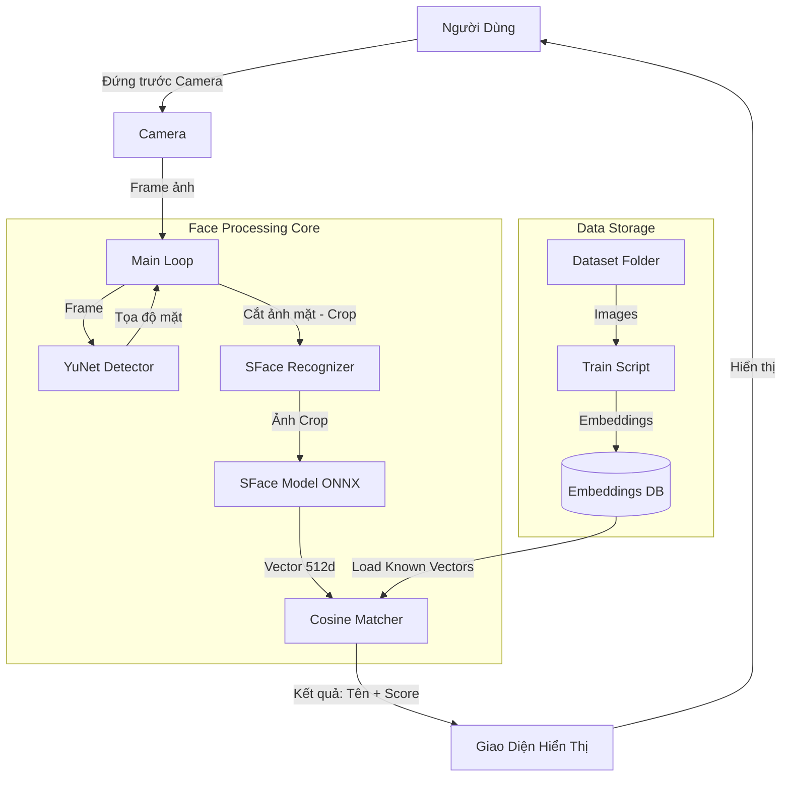
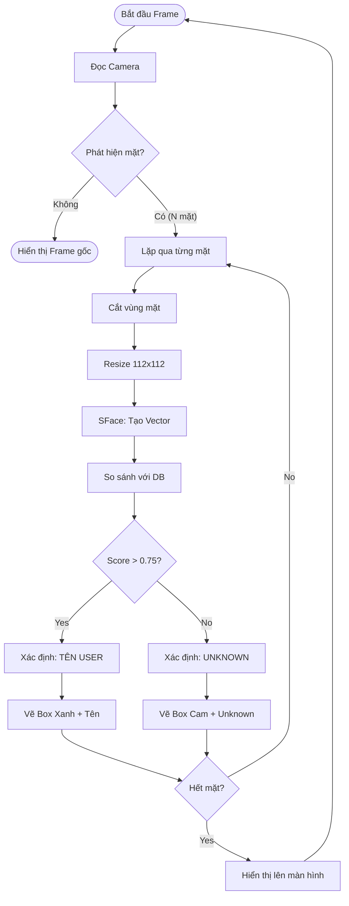
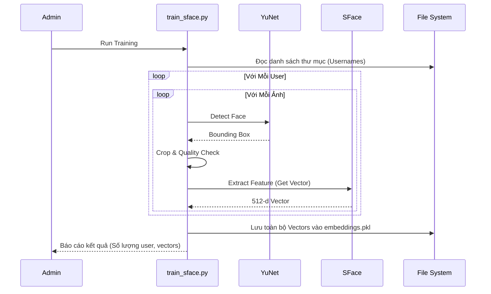

# Báo Cáo Đề Tài: Face Access Control System

## Mục Lục

1.  [Chương 1: Tổng Quan Dự Án](#chương-1-tổng-quan-dự-án)
2.  [Chương 2: Cơ Sở Lý Thuyết & Các Mô Hình](#chương-2-cơ-sở-lý-thuyết--các-mô-hình)
3.  [Chương 3: Cấu Trúc & Chức Năng Hệ Thống](#chương-3-cấu-trúc--chức-năng-hệ-thống)
4.  [Chương 4: Cơ Chế Hoạt Động & Quy Trình](#chương-4-cơ-chế-hoạt-động--quy-trình)
5.  [Phụ Lục: Sơ Đồ Hệ Thống](#phụ-lục-sơ-đồ-hệ-thống)

---

## Chương 1: Tổng Quan Dự Án

### 1.1. Giới Thiệu

**Face Access Control** là hệ thống điểm danh/kiểm soát ra vào sử dụng công nghệ nhận diện khuôn mặt. Dự án được xây dựng dựa trên các thư viện mã nguồn mở mạnh mẽ (OpenCV) và ngôn ngữ Python, tập trung vào hiệu năng thực tế và khả năng hoạt động trên các thiết bị cấu hình tầm trung (như Laptop không có GPU rời).

### 1.2. Mục Tiêu

- Xây dựng hệ thống có khả năng phát hiện và nhận diện khuôn mặt theo thời gian thực (Real-time).
- Quản lý danh sách người dùng (đăng ký, lưu trữ đặc trưng).
- Ghi lại lịch sử ra vào (Log access).
- Cung cấp giao diện trực quan cho người sử dụng.

---

## Chương 2: Cơ Sở Lý Thuyết & Các Mô Hình

Hệ thống sử dụng **2 mô hình deep learning** chính từ OpenCV Zoo:

### 2.1. Mô Hình Phát Hiện Khuôn Mặt (Face Detection): YuNet

**YuNet** là một mô hình phát hiện khuôn mặt siêu nhẹ (ultra-lightweight), tốc độ cao, được thiết kế đặc biệt cho các thiết bị biên (edge devices).

- **Nguồn gốc:** Phát triển bởi Shiqi Yu (2021) và được tích hợp vào OpenCV Zoo.
- **Kiến trúc:** Dựa trên CNN (Convolutional Neural Network) nhưng được tinh giản.
  - Sử dụng cấu trúc tương tự Feature Pyramid Network (FPN) để phát hiện khuôn mặt ở nhiều tỷ lệ khác nhau.
  - Loss function kết hợp giữa classification (mặt/không phải mặt), box regression (vị trí khung bao) và landmarks regression (vị trí 5 điểm đặc trưng).
- **Đầu ra:** Với mỗi khuôn mặt phát hiện được, YuNet trả về:
  1.  **Bounding Box:** Tọa độ (x, y, w, h).
  2.  **Landmarks:** 5 điểm quan trọng (mắt trái, mắt phải, mũi, mép miệng trái, mép miệng phải).
  3.  **Confidence Score:** Độ tin cậy của phát hiện.

**Ưu điểm:**

- **Tốc độ cực nhanh:** Có thể đạt >60 FPS trên CPU hiện đại.
- **Kích thước nhỏ:** File mô hình chỉ khoảng vài chục KB đến vài MB.
- **Độ chính xác tốt:** Hoạt động ổn định trong các điều kiện ánh sáng và góc mặt thông thường.

**Nhược điểm:**

- Khó phát hiện các khuôn mặt quá nhỏ hoặc bị che khuất quá nhiều so với các mô hình "hạng nặng" (như RetinaFace ResNet-50).

### 2.2. Mô Hình Nhận Diện Khuôn Mặt (Face Recognition): SFace

**SFace** (Sigmoid-constrained Hypersphere Face Recognition) là mô hình trích xuất đặc trưng khuôn mặt (embedding) được tối ưu hóa cho nhận diện.

- **Nguồn gốc:** Đề xuất bởi Zhong et al. (2021).
- **Cơ chế:**
  - SFace giải quyết vấn đề của các loss function trước đó (như Softmax, ArcFace) bằng cách sử dụng **Sigmoid-constrained Hypersphere Loss**.
  - Cho phép tối ưu hóa đồng thời khoảng cách nội lớp (intra-class: cùng 1 người) nhỏ nhất và khoảng cách ngoại lớp (inter-class: người khác nhau) lớn nhất.
- **Input/Output:**
  - **Input:** Ảnh khuôn mặt đã được cắt (crop) và align, kích thước chuẩn (thường là 112x112 pixel).
  - **Output:** **Vector đặc trưng 512 chiều (Embedding Vector)**. Đây là "mã số" định danh duy nhất cho khuôn mặt đó.

**Ưu điểm:**

- **Hiệu quả cao:** Độ chính xác rất cao trên các tập dữ liệu chuẩn (như LFW).
- **Nhẹ:** Kích thước mô hình nhỏ (~30-40MB), phù hợp chạy trên CPU.
- **Vector 512 chiều:** Đủ lớn để phân biệt hàng ngàn người nhưng không quá nặng để tính toán so khớp.

**Cách thức so khớp (Matching):**
Hệ thống sử dụng **Cosine Similarity** (Độ tương đồng Cosine) để so sánh vector của mặt đang thấy với vector trong database.

- Giá trị từ -1 đến 1.
- Càng gần 1: Hai khuôn mặt càng giống nhau.
- Ngưỡng (Threshold): Dự án đặt mặc định là **0.75**.

---

## Chương 3: Cấu Trúc & Chức Năng Hệ Thống

Dự án được tổ chức theo cấu trúc module hóa:

### 3.1. Các Thư Mục Chính

- `modules/`: Chứa mã nguồn lõi xử lý AI.
- `gui/`: Chứa code giao diện đồ họa.
- `dataset/`: Nơi lưu trữ ảnh gốc của người dùng dùng để train.
- `models/`: Chứa file `.onnx` của YuNet và SFace.
- `logs/`: Chứa file lịch sử ra vào (`access_log.csv`).

### 3.2. Chức Năng Từng File Quan Trọng

#### A. Module AI (`modules/`)

1.  **`modules/detector_yunet.py` (Lớp `YuNetDetector`)**

    - Quản lý mô hình YuNet.
    - Hàm `detect_faces(frame)`: Nhận ảnh đầu vào, trả về danh sách tọa độ các khuôn mặt.
    - Xử lý logic resize ảnh đầu vào về 320x320 (chuẩn của model) để đảm bảo tốc độ.

2.  **`modules/recognizer_sface.py` (Lớp `SFaceRecognizer`)**

    - Quản lý mô hình SFace.
    - Hàm `extract_embedding(face_image)`: Chuyển đổi ảnh mặt thành vector 512 chiều.
    - Hàm `train()`: Quét toàn bộ thư mục `dataset/`, tạo vector cho từng người và lưu lại.
    - Hàm `predict(face_roi)`: So sánh mặt mới với database, trả về tên người và độ tự tin.

3.  **`modules/database.py`**
    - Xử lý việc Lưu/Đọc file `embeddings.pkl`.
    - Giúp dữ liệu đã train không bị mất khi tắt ứng dụng.

#### B. Quy Trình & Entry Points

4.  **`config.py`**

    - Trung tâm điều khiển. Chứa mọi tham số: ngưỡng nhận diện (0.75), đường dẫn file, camera ID, màu sắc hiển thị.

5.  **`train_sface.py`**

    - Script thực thi quy trình "Học".
    - Đọc ảnh từ `dataset/` -> Gọi YuNet cắt mặt -> Gọi SFace trích xuất đặc trưng -> Lưu vào file.

6.  **`main.py`**
    - Chương trình chính.
    - Khởi chạy Camera.
    - Vòng lặp vô tận: Đọc Frame -> Detect -> Recognize -> Vẽ kết quả -> Hiển thị lên màn hình.

---

## Chương 4: Cơ Chế Hoạt Động & Quy Trình

### 4.1. Quy Trình Xử Lý Ảnh Để Train (Training Pipeline)

Quy trình này biến đổi ảnh thô (ảnh chụp) thành dữ liệu số (embeddings) mà máy có thể hiểu được.

1.  **Thu thập dữ liệu:** Ảnh người dùng được lưu trong `dataset/[User_Name]/`.
2.  **Duyệt ảnh & Lọc:** Script chạy qua từng ảnh.
3.  **Phát hiện (Detection):** Dùng YuNet tìm khuôn mặt trong ảnh.
    - Chỉ lấy khuôn mặt lớn nhất (để tránh lấy nhầm mặt người đứng sau).
4.  **Kiểm tra chất lượng (Quality Check):**
    - Ảnh quá tối (Mean < 40) hoặc quá mờ/nhòe (Std < 20) sẽ bị bỏ qua.
5.  **Cắt & Chuẩn hóa (Crop & Normalize):**
    - Cắt vùng mặt theo tọa độ YuNet.
    - Resize về kích thước **112x112 pixel**.
6.  **Trích xuất đặc trưng (Embedding):**
    - Ảnh 112x112 -> SFace Model -> Vector [1x512].
    - Chuẩn hóa L2 (L2-Norm) cho vector để đưa về độ dài đơn vị (giúp tính Cosine chính xác).
7.  **Lưu trữ:** Lưu danh sách Tên + List các Vector tương ứng vào file `embeddings.pkl`.

### 4.2. Quy Trình Nhận Diện Thời Gian Thực (Inference Pipeline)

Xảy ra liên tục khi chạy `main.py`:

1.  **Camrea Capture:** Lấy 1 khung hình (Frame).
2.  **Detection (YuNet):** Tìm vị trí tất cả khuôn mặt trong Frame.
3.  **Loop (Với mỗi mặt tìm được):**
    - Cắt vùng mặt (ROI).
    - Đưa vào SFace để lấy **Vector A** (Vector hiện tại).
    - So sánh **Vector A** với **tất cả Vector B** (trong Database đã train).
    - Tính điểm **Cosine Similarity**.
    - Lấy điểm cao nhất (Max Score).
4.  **Quyết định (Decision):**
    - Nếu Max Score > **Threshold (0.75)**: => **KNOWN** (Hiện tên người đó).
    - Ngược lại: => **UNKNOWN**.

---

## Phụ Lục: Sơ Đồ Hệ Thống

### 1. Sơ Đồ Kiến Trúc (Architecture Diagram)

### 2. Lưu Đồ Thuật Toán Nhận Diện (Recognition Flowchart)

### 3. Dataflow Diagram (Training Phase)

