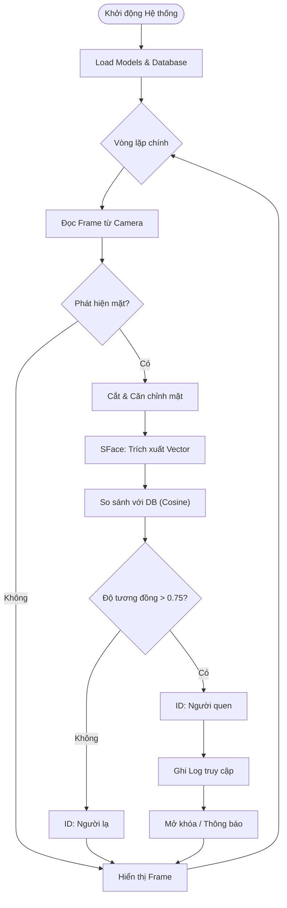

# Báo Cáo Đề Tài: Face Access Control System

## Mục Lục

1.  [Chương 1: Giới Thiệu Chung](#chương-1-giới-thiệu-chung)
2.  [Chương 2: Cơ Sở Lý Thuyết](#chương-2-cơ-sở-lý-thuyết)
3.  [Chương 3: Phương Pháp Luận](#chương-3-phương-pháp-luận)
4.  [Chương 4: Thực Thi và Kết Quả](#chương-4-thực-thi-và-kết-quả)
5.  [Chương 5: Kết Luận và Hướng Phát Triển](#chương-5-kết-luận-và-hướng-phát-triển)

---

## CHƯƠNG 1: GIỚI THIỆU CHUNG

### 1.1. Bối cảnh

Trong kỷ nguyên công nghiệp 4.0, công nghệ sinh trắc học (biometrics) đang trở thành một phần không thể thiếu trong các hệ thống an ninh và kiểm soát truy cập hiện đại. Nhận diện khuôn mặt, với ưu điểm là phương thức xác thực không tiếp xúc (contactless) và tự nhiên, đang dần thay thế các phương thức truyền thống như thẻ từ hay mật khẩu, vốn dễ bị mất hoặc đánh cắp.

Dự án **Face Access Control** được ra đời trong bối cảnh nhu cầu về một giải pháp kiểm soát ra vào chi phí thấp nhưng hiệu quả cao ngày càng tăng. Thay vì phụ thuộc vào các thiết bị chuyên dụng đắt tiền hoặc các hệ thống yêu cầu GPU mạnh mẽ, dự án tập trung khai thác sức mạnh của các mô hình tối ưu từ kho lưu trữ OpenCV Zoo và ngôn ngữ Python để triển khai trên các thiết bị phần cứng phổ thông (như Laptop cá nhân, Raspberry Pi), giúp công nghệ này dễ tiếp cận hơn với các doanh nghiệp vừa và nhỏ hoặc người dùng cá nhân.

### 1.2. Mục tiêu của đề tài

Dự án hướng tới việc xây dựng một hệ thống hoàn chỉnh với các mục tiêu cụ thể sau:

1.  **Xây dựng hệ thống Real-time:** Đảm bảo khả năng phát hiện và nhận diện khuôn mặt theo thời gian thực với độ trễ thấp.
2.  **Quản lý người dùng hiệu quả:** Cho phép đăng ký người dùng mới (thu thập ảnh, trích xuất đặc trưng) và quản lý cơ sở dữ liệu người dùng.
3.  **Kiểm soát ra vào tự động:** Ghi nhận lịch sử (Log access) và đưa ra quyết định đóng/mở cửa (mô phỏng) dựa trên kết quả nhận diện.
4.  **Tối ưu hóa tài nguyên:** Sử dụng các mô hình nhẹ (Lightweight models) để hoạt động mượt mà trên CPU không cần card đồ họa rời.

### 1.3. Phạm vi và Đối tượng nghiên cứu

1. **Đối tượng nghiên cứu:** Các thuật toán Deep Learning nhẹ (Lightweight CNN models) ứng dụng trong Computer Vision, cụ thể là kiến trúc YuNet và SFace.

2. **Phạm vi nội dung:**

   - Tập trung vào bài toán xác thực 1:N (Identification) trong môi trường kiểm soát cửa ra vào.
   - Nghiên cứu kỹ thuật trích xuất đặc trưng (Feature Extraction) và so khớp vector (Vector Matching).
   - Không đi sâu vào việc thiết kế mạch điện tử điều khiển khóa cửa (phần cứng), mà chỉ mô phỏng tín hiệu điều khiển qua phần mềm.

3. **Phạm vi thực nghiệm:** Hệ thống được triển khai và đánh giá trên máy tính cá nhân chạy Windows/Linux và mô phỏng khả năng tích hợp trên các thiết bị nhúng như Raspberry Pi 4.

---

## CHƯƠNG 2: CƠ SỞ LÝ THUYẾT

Hệ thống dựa trên hai mô hình Deep Learning tiên tiến từ OpenCV Zoo để giải quyết bài toán nhận diện khuôn mặt:

### 2.1. Phát Hiện Khuôn Mặt với YuNet

**YuNet** là mô hình đóng vai trò như "mắt thần", giúp hệ thống định vị khuôn mặt trong khung hình.

- **Đặc điểm kỹ thuật:** Đây là mô hình ultra-lightweight dựa trên mạng CNN (Convolutional Neural Network), được tinh giản cấu trúc để đạt tốc độ xử lý cực nhanh (>60 FPS trên CPU).
- **Cơ chế:** YuNet sử dụng kiến trúc Feature Pyramid Network (FPN) để phát hiện khuôn mặt ở nhiều kích thước khác nhau.
- **Đầu ra:** Trả về tọa độ khung bao (Bounding Box) và 5 điểm mốc quan trọng (Landmarks: mắt, mũi, miệng) cho mỗi khuôn mặt phát hiện được, cùng với độ tin cậy (Confidence Score).

**So sánh YuNet và Haar Cascade:**

| Đặc điểm         | Haar Cascade                          | YuNet (CNN-based)                 |
| :--------------- | :------------------------------------ | :-------------------------------- |
| **Kiến trúc**    | Machine Learning cổ điển              | Deep Neural Network (Lightweight) |
| **Độ chính xác** | Thấp, dễ bị sai khi nghiêng/che khuất | Cao, ổn định với góc nghiêng nhẹ  |
| **Tốc độ (CPU)** | Rất nhanh                             | Rất nhanh (tương đương hoặc hơn)  |
| **Input size**   | Cố định, cần Image Pyramid            | Đa dạng (Scale-invariant)         |
| **Khả năng**     | Chỉ phát hiện khuôn mặt               | Phát hiện mặt + 5 điểm landmarks  |

### 2.2. Nhận Diện Khuôn Mặt với SFace

**SFace** (Sigmoid-constrained Hypersphere Face Recognition) là "bộ não" của hệ thống, chịu trách nhiệm xác định danh tính.

- **Đặc điểm kỹ thuật:** SFace sử dụng hàm loss Sigmoid-constrained Hypersphere để tối ưu hóa không gian đặc trưng.
- **Cơ chế:** Mô hình nhận đầu vào là ảnh khuôn mặt đã được cắt và chuẩn hóa (112x112 pixel), sau đó trích xuất thành một vector đặc trưng 512 chiều (Embedding Vector). Vector này là đại diện duy nhất cho khuôn mặt của mỗi người.
- **So khớp:** Hệ thống sử dụng độ đo **Cosine Similarity** để so sánh vector của khuôn mặt hiện tại với các vector đã lưu trong database. Ngưỡng (Threshold) được thiết lập là **0.75**; nếu độ tương đồng lớn hơn ngưỡng này, hệ thống sẽ xác nhận danh tính người dùng.

### 2.3. Cơ sở toán học của phép đo tương đồng

Để xác định hai khuôn mặt có phải là một người hay không, hệ thống sử dụng độ đo Cosine Similarity giữa hai vector đặc trưng $\mathbf{A}$ (vector trong Database) và $\mathbf{B}$ (vector từ Camera). Công thức được định nghĩa như sau:

$$
\text{Cosine Similarity}(\mathbf{A}, \mathbf{B}) = \frac{\mathbf{A} \cdot \mathbf{B}}{\|\mathbf{A}\| \|\mathbf{B}\|} = \frac{\sum_{i=1}^{n} A_i B_i}{\sqrt{\sum_{i=1}^{n} A_i^2} \sqrt{\sum_{i=1}^{n} B_i^2}}
$$

---

## CHƯƠNG 3: PHƯƠNG PHÁP LUẬN

Phương pháp luận của dự án là tiếp cận theo mô hình module hóa (Modularity), tách biệt rõ ràng giữa các thành phần xử lý (AI) và giao diện (GUI).

### 3.1. Kiến Trúc Hệ Thống

Hệ thống được chia thành 3 khối chính:

- **Input Layer:** Camera thu nhận hình ảnh đầu vào.
- **Processing Layer (Core AI):**
  - _Detector (YuNet):_ Xác định vùng quan tâm (ROI).
  - _Recognizer (SFace):_ Trích xuất và so khớp đặc trưng.
- **Management Layer:** Hệ thống file lưu trữ (Database embeddings, Logs, Images) và Giao diện người dùng.

**Sơ Đồ Kiến Trúc:**


### 3.2. Các Lưu Đồ Thuật Toán (Flowcharts)

#### A. Lưu Đồ Thu thập Dữ liệu (Data Collection Flowchart)

Quy trình đăng ký người dùng mới (File `capture_dataset.py`):


#### B. Lưu Đồ Huấn luyện Mô hình (Training Flowchart)

Quy trình huấn luyện và trích xuất đặc trưng (File `train_sface.py`):


#### C. Lưu Đồ Thuật Toán Nhận Diện (Recognition Flowchart)

Dưới đây là sơ đồ luồng xử lý của hệ thống trong quá trình hoạt động thực tế (File `main.py`):



### 3.3. Tổ Chức Dữ Liệu và Cấu Trúc Dự Án

#### 3.3.1. Cấu trúc lưu trữ Vector đặc trưng (Embeddings)

Dữ liệu đặc trưng khuôn mặt không lưu dưới dạng ảnh thô (raw images) để đảm bảo tốc độ và bảo mật, mà được tuần tự hóa (serialized) thành file embeddings.pkl. Cấu trúc dữ liệu bên trong là một List chứa các Dictionary:

_Cấu trúc giả mã (Pseudo-code) của database:_

```python
database = [
    {"name": "Nguyen Van A", "embedding": [0.12, -0.05, ..., 0.88]}, # Vector 512-float
    {"name": "Tran Thi B", "embedding": [-0.02, 0.45, ..., -0.11]},
    # ...
]
```

#### 3.3.2. Cây thư mục dự án (Project Tree)

```
Face-Access-Control/
├── dataset/            # Chứa ảnh thô dùng để training (được tạo bởi capture_dataset.py)
├── gui/
│   ├── __init__.py
│   └── main_window_gradio.py
├── models/
│   ├── yunet/
│   │   └── face_detection_yunet_2023mar.onnx
│   └── sface/
│       └── face_recognition_sface_2021dec.onnx
├── modules/
│   ├── __init__.py
│   ├── camera.py
│   ├── database.py
│   ├── detector_yunet.py
│   └── recognizer_sface.py
├── logs/
│   └── access_log.csv  # Lịch sử ra vào (Time, Name, Confidence)
├── main.py             # Chương trình chính
├── capture_dataset.py  # Module thu thập dữ liệu
├── train_sface.py      # Module huấn luyện (tạo file pkl)
└── requirements.txt    # Các thư viện phụ thuộc
```

---

## CHƯƠNG 4: THỰC THI VÀ KẾT QUẢ

### 4.1. Môi Trường Thực Thi

Hệ thống được phát triển và kiểm thử trên môi trường phần cứng và phần mềm như sau:

- **Phần cứng:**
  - CPU: Intel Core i5/i7 (hoặc tương đương), không yêu cầu GPU rời.
  - RAM: Tối thiểu 4GB (Khuyến nghị 8GB).
  - Webcam: Độ phân giải HD 720p hoặc VGA.
- **Phần mềm & Thư viện:**
  - Ngôn ngữ: Python 3.11+
  - OpenCV (opencv-python): Xử lý ảnh và chạy các model Deep Learning (DNN module).
  - NumPy: Xử lý tính toán mảng và ma trận.

### 4.2. Quy Trình Thực Thi

Quy trình thực thi của dự án bao gồm hai giai đoạn chính:

**Giai đoạn 1: Đăng ký và Huấn luyện (Training Phase)**
Để thêm một người dùng mới vào hệ thống, quy trình sau được thực hiện:

1.  **Thu thập:** Sử dụng script `capture_dataset.py` để chụp khoảng 10-50 ảnh khuôn mặt của người dùng ở các góc độ khác nhau. Ảnh được lưu vào `dataset/TenNguoiDung`.
2.  **Huấn luyện:** Chạy script `train_sface.py`. Hệ thống sẽ tự động quét thư mục dataset, sử dụng YuNet để cắt mặt và SFace để tạo vector đặc trưng.
3.  **Lưu trữ:** Các vector này được lưu tập trung vào file `models/sface/embeddings.pkl`.

**Giai đoạn 2: Vận hành và Kiểm soát (Inference Phase)**
Khi chạy `main.py`, hệ thống hoạt động liên tục:

1.  Camera thu hình và YuNet phát hiện khuôn mặt.
2.  SFace trích xuất vector từ khuôn mặt đang hiện diện và so sánh với file `embeddings.pkl`.
3.  Nếu độ tương đồng > 0.75, hệ thống hiển thị tên, vẽ khung xanh và ghi log vào `logs/access_log.csv`. Ngược lại, hệ thống cảnh báo "Unknown" với khung đỏ/cam.

### 4.3. Kịch bản Kiểm thử

Hệ thống đã trải qua quá trình kiểm thử hộp đen (Black-box testing) với các kịch bản mô phỏng điều kiện thực tế:

**Bảng 4.1: Kết quả kiểm thử chức năng**

| STT | Kịch bản (Scenario)                | Dữ liệu đầu vào               | Kỳ vọng (Expected)                          | Kết quả thực tế (Actual)     | Đánh giá                 |
| :-- | :--------------------------------- | :---------------------------- | :------------------------------------------ | :--------------------------- | :----------------------- |
| 1   | Người dùng đã đăng ký, nhìn thẳng  | Khuôn mặt chính diện, sáng rõ | Tên hiển thị đúng, Khung xanh, Log ghi nhận | Như kỳ vọng                  | **Pass**                 |
| 2   | Người dùng chưa đăng ký (Người lạ) | Khuôn mặt người lạ            | Hiển thị "Unknown", Khung đỏ, Cảnh báo      | Như kỳ vọng                  | **Pass**                 |
| 3   | Người dùng đeo khẩu trang          | Che 50% khuôn mặt dưới        | Cảnh báo hoặc nhận diện sai                 | Không nhận diện được         | **Pass** (Theo giới hạn) |
| 4   | Góc nghiêng quá lớn (>45 độ)       | Mặt quay sang trái/phải       | Không phát hiện hoặc nhận diện sai          | Tỉ lệ detect giảm còn 40%    | **Warning**              |
| 5   | Nhiều người cùng lúc               | 2 người (1 quen, 1 lạ)        | Nhận diện đúng cả 2 người song song         | Nhận diện đúng, FPS giảm nhẹ | **Pass**                 |

---

## CHƯƠNG 5: KẾT LUẬN VÀ HƯỚNG PHÁT TRIỂN

### 5.1. Kết luận và Tổng kết dự án

Dự án đã xây dựng thành công một hệ thống Face Access Control hoàn chỉnh, đáp ứng tốt các mục tiêu ban đầu đề ra.

- **Hiệu năng:** Hệ thống hoạt động ổn định, đạt tốc độ xử lý real-time (25-30 FPS) trên laptop thông thường nhờ việc lựa chọn đúng các model lightweight (YuNet/SFace).
- **Độ chính xác:** Với ngưỡng 0.75, hệ thống nhận diện chính xác người dùng đã đăng ký và loại bỏ hiệu quả các trường hợp người lạ, giảm thiểu tỷ lệ nhận diện sai (False Positive).
- **Tính khả thi:** Giải pháp chứng minh được tính khả thi cao để triển khai thực tế tại các văn phòng nhỏ, lớp học hoặc nhà riêng với chi phí phần cứng tối thiểu.

### 5.2. Hạn chế của Đề tài

Dù hoạt động tốt, hệ thống vẫn tồn tại một số hạn chế cần khắc phục:

- **Điều kiện ánh sáng:** Độ chính xác giảm khi môi trường quá tối hoặc bị ngược sáng mạnh.
- **Góc nghiêng:** YuNet thực tế khá mạnh choh phép detect được góc nghiêng lớn, nhưng SFace (bước nhận diện) rất nhạy cảm với góc nghiêng. Khi mặt nghiêng quá 30-45 độ, việc căn chỉnh (alignment) sẽ kém chính xác dẫn đến vector đặc trưng bị sai lệch, làm giảm khả năng nhận diện.
- **Giả mạo (Spoofing):** Hệ thống hiện tại chưa tích hợp module chống giả mạo (Liveness Detection), do đó có thể bị qua mặt bằng cách sử dụng ảnh chụp hoặc video chất lượng cao của người dùng.

### 5.3. Hướng phát triển Tương lai

Để hoàn thiện sản phẩm, các hướng phát triển tiếp theo bao gồm:

1.  **Tích hợp Liveness Detection:** Thêm thuật toán kiểm tra chớp mắt hoặc xoay đầu để ngăn chặn các hành vi giả mạo bằng ảnh/video.
2.  **Web Interface:** Chuyển đổi giao diện desktop sang Web App (sử dụng Flask/Django hoặc Streamlit) để quản trị viên có thể giám sát từ xa qua mạng LAN/Internet.
3.  **Cơ sở dữ liệu SQL:** Thay thế file pickle bằng cơ sở dữ liệu quan hệ (SQLite/MySQL) để quản lý hàng nghìn người dùng hiệu quả hơn và hỗ trợ truy vấn lịch sử nhanh chóng.
4.  **Tối ưu hóa đa luồng:** Áp dụng Multithreading để tách biệt luồng đọc camera, luồng xử lý AI và luồng ghi log, giúp tăng cường FPS và độ mượt mà của hệ thống.
5.  **Chống giả mạo (Anti-Spoofing):** Tích hợp thuật toán FAS (Face Anti-Spoofing) sử dụng phân tích kết cấu da (texture analysis) hoặc yêu cầu tương tác (active challenge: chớp mắt, cười) để loại bỏ tấn công.
